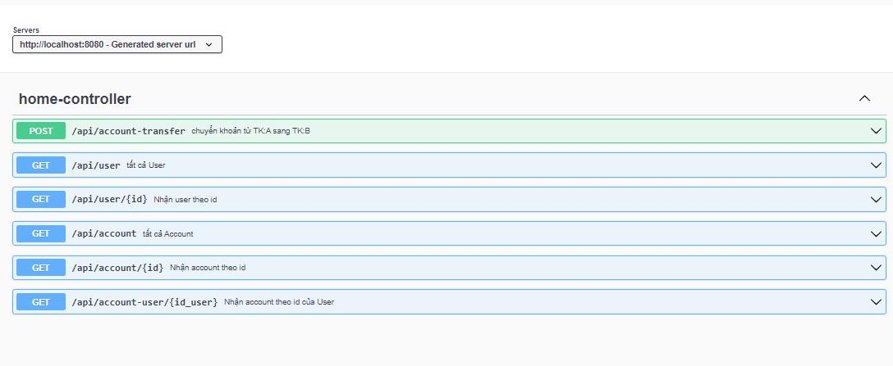
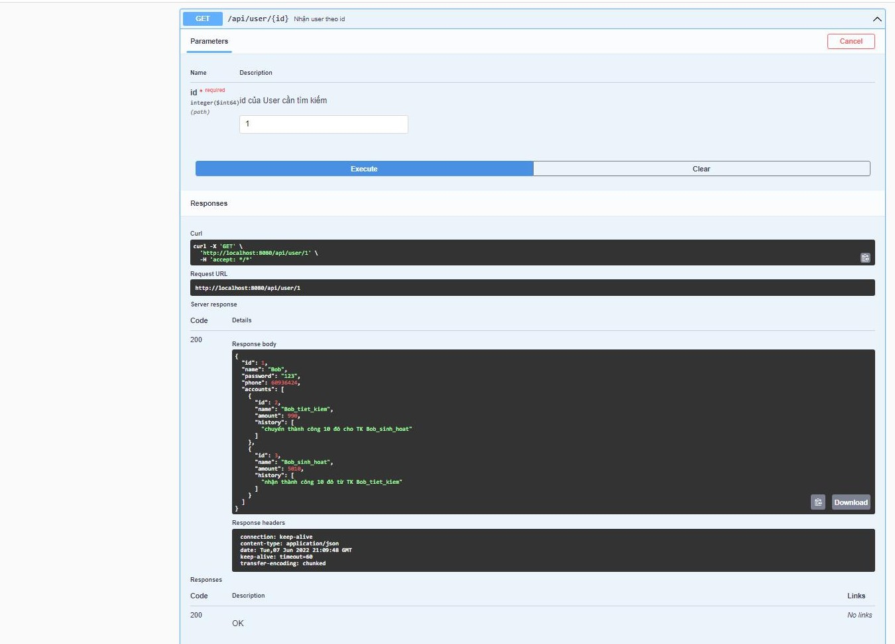
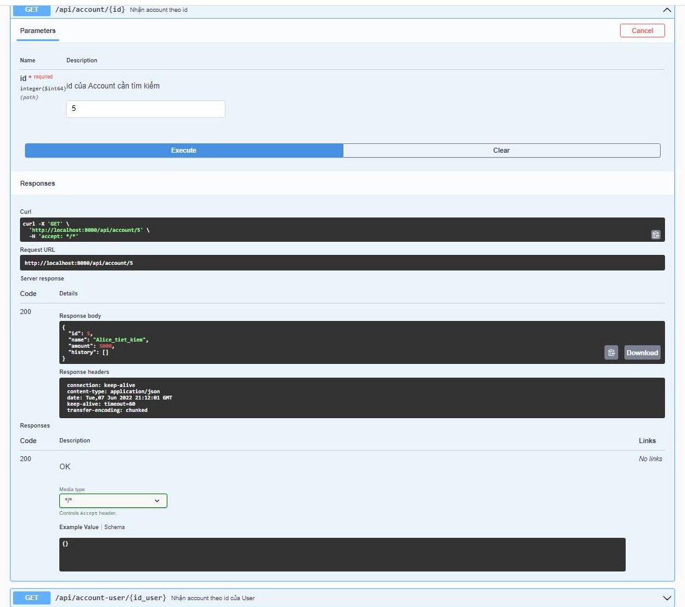
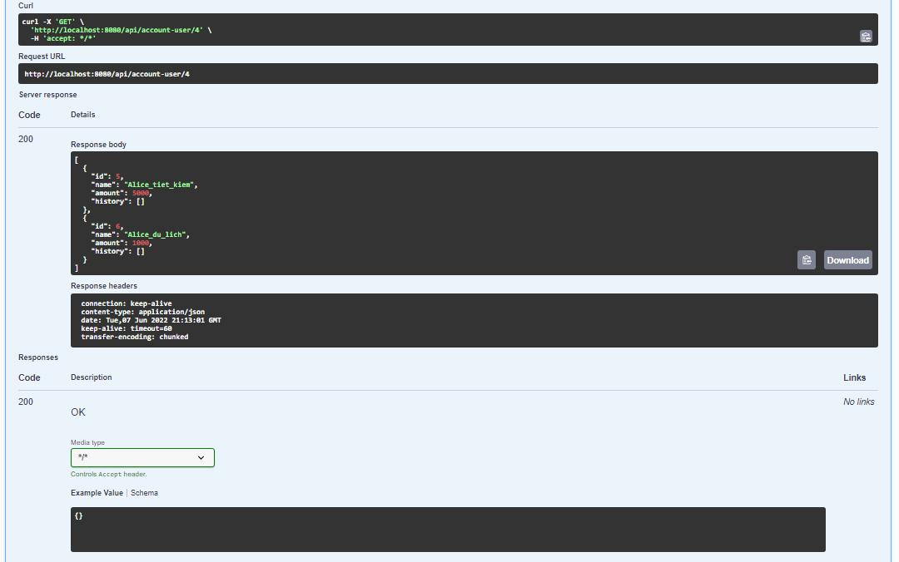
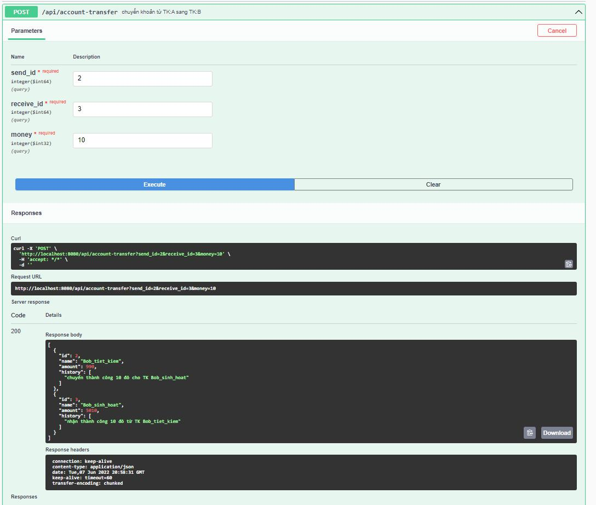
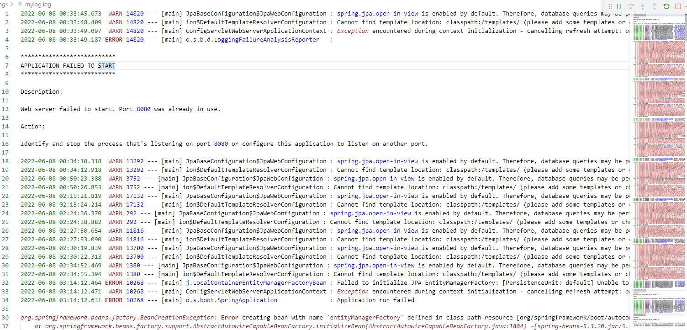

## **Xây dựng ứng dụng mô phỏng ngân hàng**

# Yêu cầu chung
1. Một User sở hữu nhiều Account. Quan hệ 1:Many Bidirection, Cascading All

2. Tạo 4 User: Bob, Alice, Tom, Sara. Mỗi người có từ 1 đến vài Account.

3. Tạo TransferException để xử lý các ngoại lệ khi chuyển tiền. TransferException 
cần ghi lại chi tiết nội dung chuyển tiền.

4. Tạo REST API gồm có:
+ userById
+ accountById
+ accountsByUserId
+ transfer(accountA, accountB, amount)
+ Cấu hình Log4J2 để ghi log ra file transfer_error.log khi có TransferException được ném ra.

### Để sử dụng OpenAPI truy cập [http://localhost:8080/swagger-ui/index.html#](http://localhost:8080/swagger-ui/index.html#)

- userById OpenAPI

- accountById OpenAPI

-  accountsByUserId OpenAPI

- transfer(accountA, accountB, amount) OpenAPI

- nội dung file transfer_error.log

