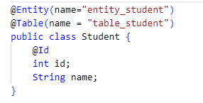

## Kiểm tra Kiến Thức JPA
***
**1. Thuộc tính name trong annotation @Entity khác với thuộc tính name trong @Table như thế
nào? Hãy giải thích rõ cần thì minh hoạ**

```
- @Entity(name = ‘EntityName’) dùng để chỉ tên của entity được Hibernate quản lý  
- @Table(name = “TableName”) chỉ đích danh tên của table dưới database
- Ví dụ:
```

```hibernate
Hibernate: INSERT INTO table_student (id,name) VALUES (1,'Th? nh')
Hibernate: INSERT INTO  table_student (id,name) VALUES (2,'Khi?ªm')
Hibernate: INSERT INTO  table_student (id,name) VALUES (3,'SÆ¡n')
```

**2. Để debug câu lệnh SQL mà Hibernate sẽ sinh ra trong quá trình thực thi, cần phải bổ sung
lệnh nào vào file application.properties?**
```sql
spring.jpa.properties.hibernate.hbm2ddl.import_files=table_student.sql
```
**3. Khi sử dụng H2, làm thế nào để xem được cơ sở dữ liệu và viết câu truy vấn?**
```
truy cập locohost:8080/h2-console và đăng nhập để xem cơ sở dữ liệu và viết truy vấn
```
**4. Khi viết mô tả một model, những thuộc tính chúng ta không muốn lưu xuống CSDL thì cần
đánh dấu bằng annotation nào?**
```
@Transient
```
**5. Annotation @Column dùng để bổ sung tính chất cho cột ứng với một thuộc tính. Tham số
nào trong @Column sẽ đổi lại tên cột nếu muốn khác với tên thuộc tính, tham số nào chỉ định
yêu cầu duy nhất, không được trùng lặp dữ liệu, tham số nào buộc trường không được null?**
```
- @Column(name ="") dùng để đổi tên cột mặc định sang tên cột tương ứng trên CSDL
- @Id chỉ định yêu cầu duy nhất, không được trùng lặp dữ liệu
- @Column(nullable = false): buộc trường không được null
```
**6. Có 2 sự kiện mà JPA có thể bắt được, viết logic bổ sung**
- **Ngay trước khi đối tượng Entity lưu xuống CSDL (ngay trước lệnh INSERT)**
- **Ngay trước khi đối tượng Entity cập nhật xuống CSDL (ngay trước lệnh UPDATE)
Vậy 2 annotation này là gì**
```
@PrePersist và @ PreUpdate
```
**7. Tổ hợp các trường thông tin địa chỉ: country, city, county, addressline thường luôn đi cùng
nhau và sử dụng lại trong các Entity khác nhau. Nhóm 2 annotation nào dùng để tái sử dụng,
nhúng một Entity vào một Entity khác?**
```
@Embeddable và @Embedded
```
**8. JpaRepository là một interface có sẵn trong thư viện JPA, nó cũng cấp các mẫu hàm thuận tiện cho thao tác dữ liệu. Cụ thể JpaRepository kế thừa từ interface nào?**
```
JPA Repository kế thừa các interface :CRUD Repository ,Sắp Xếp, Phân Trang
```
**9. Hãy viết khai báo một interface repository thao tác với một Entity tên là Post, kiểu dữ liệu
trường Identity là long, tuân thủ interface JpaRepository.**
```java
package vn.techmaster.examjpa.repository;

import org.springframework.data.jpa.repository.JpaRepository;
import org.springframework.stereotype.Repository;

import vn.techmaster.examjpa.model.Post;

@Repository
public interface PostRepo extends JpaRepository<Post,Long> { }
```

**10. Khi đã chọn một cột là Identity dùng @Id để đánh dấu, thì có cần phải dùng xác định unique
dùng annotation @Column(unique=true) không?**
```
Không cần
```
**11. Khác biệt giữa @Id với @NaturalId là gì?**
```
@Id không được thay đổi, 
@NaturalId có thể được phép thay đổi
```
**12. Có những cột không phải primary key (@Id) hay @NaturalId, dữ liệu có thể trùng lặp (unique không đảm bảo true), nhưng cần đánh chỉ mục (index) để tìm kiếm nhanh hơn vậy
phải dùng annotation gì? Hãy viết 1 ví dụ sử dụng annotation đó với index cho 1 column và 1
ví dụ với index cho tổ hợp nhiều column. Tham khảo tại (https://www.baeldung.com/jpaindexes)**

**13. Annotation @GeneratedValue dùng để chọn cách tự sinh unique id cho primary key phải là
trường kiểu int hoặc long. Nếu trường primary key có kiểu là String, chúng ta không thể
dùng @GeneratedValue vậy hãy thử liệt kê các cách đảm bảo sinh ra chuỗi có tính duy nhất?**
```java
public class Story {
  @Id
  private String id;  
  private String name;

  public Story(String name) {
    this.id = UUID.randomUUID().toString();
    this.name = name;
  }
}
```
**14. Giả sử có 1 class Employee với các fields sau {id, emailAddress, firstName, lastName}. Hãy
viết các method trong interface EmployeeRespository để :**
- Tìm tất cả các Employee theo emailAddress và lastName
```java
List<Employee> findByEmailAddressAndLastname(EmailAddress emailAddress, String lastname);
```
-  Tìm tất cả các Employee khác nhau theo firstName hoặc lastName
```java
    List<Employee> findDistinctPeopleByLastnameOrFirstname(String lastname, String firstname);
```
- Tìm tất cả các Employee theo lastName và sắp xếp thứ tự theo firstName tăng dần
```java     
      List<Emloyee> findByFirstnameOrderByLastnameAsc(String firstname);
```

-  Tìm tất cả các Employee theo fistName không phân biệt hoa thường
```java
List<Person> findByFistnameIgnoreCase(String firstname);
```

**15. Hãy nêu cách sử dụng của @NamedQuery và @Query. Cho ví dụ**
```

```
**16. Làm thế nào để có thể viết custom method implemetations cho Jpa Repository. Nêu ví dụ**

**17. Hãy nêu 1 ví dụ sử dụng sorting và paging khi query đối tượng Employee ở trên**
```
Sort
// OrderBy là cách sắp xếp thứ tự trả về
// Sắp xếp theo Firstname Desc
    List<Employee> findByLastnameOrderByFirstnameDesc(String lastname);
```
```
Paging
           List<Employee> findAllByLastNameLike(String lastname, Pageable pageable);
;

**18. Có 3 Entity Product.java và Category.java và Tag.java**
- Hãy bổ sung định nghĩa quan hệ One to Many giữa bảng Category (One) -- Product
(Many). Chú ý khi một Category xoá, thì không được phép xoá Product, mà chỉ set
thuộc tính Category của Product là null.

- Hãy bổ sung định nghĩa quan hệ Many to Many giữa bảng Tag(Many) --
Product(Many).
```java
@Entity(name="product")
@Table(name="product")
@Data
public class Product {
 @Id
 @GeneratedValue(strategy = GenerationType.AUTO)
 private long id;
 private String name;
}
```
```java
@Entity(name="category")
@Table(name="category")
@Data
public class Category {
 @Id
 @GeneratedValue(strategy = GenerationType.AUTO)
 private long id;
 private String name;
}
```
```java
@Entity(name="tag")
@Table(name="tag")
@Data
public class Tag {
 @Id
 @GeneratedValue(strategy = GenerationType.AUTO)
 private long id;
 private String name;
 ```